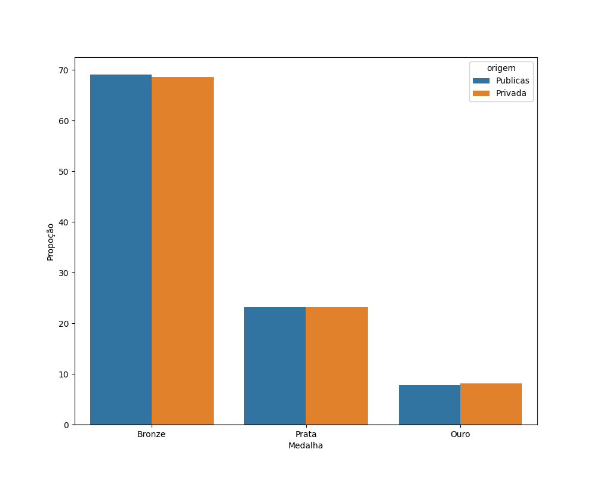

# 1Sti_GabrielMizuno

## Insights

1 -

As imagens abaixo mostram as escolas com maior número de medalhas

Geral

Pública

Privada

2 -

3 - 

## Plus

- Fazer um desenho da arquitetura de como seria a solução em produção, detalhando o fluxo dos dados e os componentes usados.

Arquitetura 

Também será possível usar Docker para isolar o ambiente e facilar sua manutenção em caso de problema de infraestrutura.

- Gerar análises gráficas dos dados através de consultas no Athena com biblioteca Python boto3.

